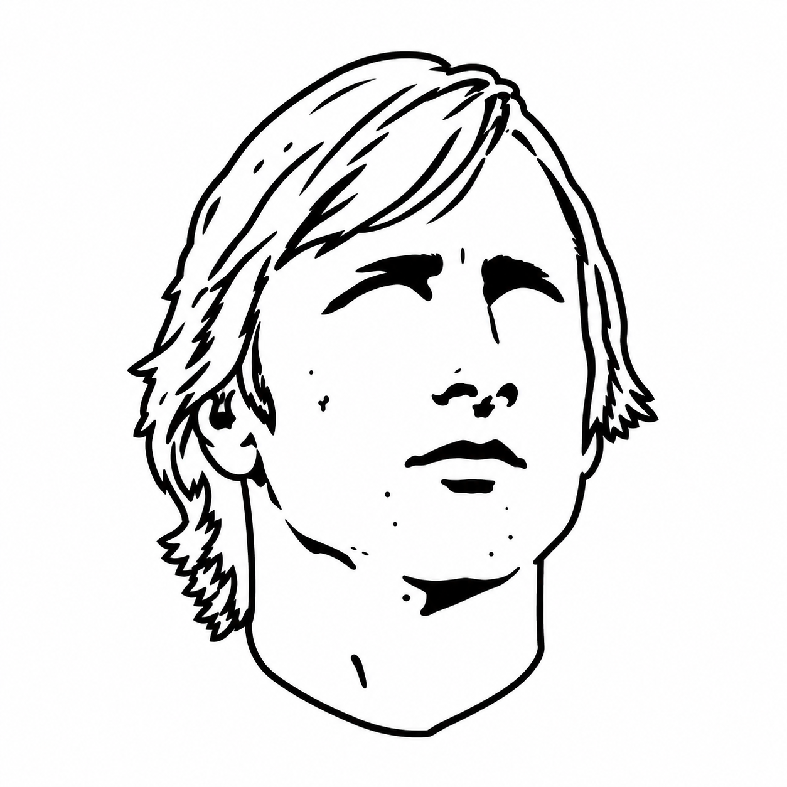

<p align="center">
  
</p>

<h1 align="center">Total Programming</h1>

<p align="center">
  
  
  
</p>

<p align="center"><em>A team of 11 principles for attacking hard problems at a sustained pace—for humans and AI agents.</em></p>

<p align="center">
  <a href="#1-start-with-the-goal-and-why-it-matters--intent">1. Intent</a><br>
  <a href="#2-make-it-obvious-not-explained--clarity">2. Clarity</a> •
  <a href="#3-give-each-part-one-responsibility-and-a-small-surface--atomicity">3. Atomicity</a> •
  <a href="#4-prefer-reversible-decisions-to-preserve-momentum--reversibility">4. Reversibility</a> •
  <a href="#5-focus-where-it-matters--asymmetry">5. Asymmetry</a><br>
  <a href="#6-fit-the-problem-not-its-noise--parsimony">6. Parsimony</a> •
  <a href="#8-try-removing-before-adding--subtraction">8. Subtraction</a> •
  <a href="#10-reduce-complexity-across-the-whole-system--holism">10. Holism</a><br>
  <a href="#7-tackle-consequential-uncertainty-first--falsification">7. Falsification</a> •
  <a href="#9-let-evidence-shape-the-design--empiricism">9. Empiricism</a> •
  <a href="#11-progress-in-small-verifiable-steps--progression">11. Progression</a>
</p>

<p align="center">Product Management • Product Design • Software Architecture • Software Engineering</p>

## Contents

- [Philosophy](#philosophy)
- [The principles](#the-principles)
- [Benchmark](#benchmark)
- [Install](#install)
- [Local development](#local-development)
- [Uninstall](#uninstall)
- [Background](#background)

## Philosophy

Sustained pace comes from the ability to understand, change, and validate software with little friction. Keep necessary complexity manageable and remove unnecessary complexity so that each addition does not progressively limit your freedom to act.

Like Total Football, agility is not everyone moving faster independently. It comes from clear responsibilities, coordinated movement, and simple passes that keep the next move available.

**We pursue simplicity not to build less capable software, but to preserve our ability to keep improving it.** These principles apply to interfaces, interactions, code, and architecture—for humans and AI agents alike.

## The principles

The agent-facing text lives in [`SKILL.md`](skills/total-programming/SKILL.md), which is the single source of truth. Below, each principle is paired with a Johan Cruyff quote, where it comes from on the pitch, and why it belongs in software.

### 1. Start with the goal and why it matters — *Intent*

> "I hate someone who moves but doesn't know where to."

**On the pitch.** Total Football only works when every player knows the plan. Players rotate positions and improvise constantly, and that freedom holds together only because everyone is working toward the same goal. A player who moves without knowing where to pulls the team's shape apart.

**In software.** Know what someone needs to accomplish, why it matters, and what success looks like before choosing screens, frameworks, or functions. A shared goal with its why lets people adapt the how—take a different route, improvise, swap roles—and still converge. Without it, activity looks like progress while the system drifts apart.

### 2. Make it obvious, not explained — *Clarity*

> "If I had wanted you to understand it, I would have explained it better."

**On the pitch.** Cruyff was famous for cryptic one-liners, known in Dutch as *Cruijffiaans*, that people still debate decades later. Charming from a football legend.

**In software.** Costly anywhere else. Read the quote as the anti-pattern: work that only makes sense once its author explains it. If something needs explaining, first ask whether it can be made obvious instead. Obvious is the result, not the first idea—as Cruyff knew, simple football is the hardest kind. The next person or agent who must change your work should not need an oracle.

### 3. Give each part one responsibility and a small surface — *Atomicity*

> "I'm the worst if I have to defend the whole garden, but I'm the best if I have to defend this part. Everything is about space, nothing more."

**On the pitch.** Zonal defending: each player is responsible for a defined space, so the team defends as a coordinated unit instead of everyone chasing the ball. The zone is defined, not tiny.

**In software.** Like the Unix philosophy, each part should do one thing well—and like John Ousterhout's deep modules, it should put substantial behavior behind a simple interface. Atomic means indivisible, not small: a part is as large as its responsibility requires, and splitting it further only scatters one idea across several places. Many shallow parts don't remove complexity; they move it into the wiring between them.

### 4. Prefer reversible decisions to preserve momentum — *Reversibility*

> "If we have the ball, they can't score."

**On the pitch.** Possession. As long as you keep the ball, you decide the next move and the opponent can only react. Lose it, and the initiative is theirs.

**In software.** A reversible decision keeps the next move yours; an irreversible one gives the ball away. Most decisions are two-way doors, to borrow Jeff Bezos's distinction: make them quickly and let the result guide the next. Save deliberation and stronger evidence for one-way doors, the commitments that are hard to undo. Momentum comes from acting on what you learn, not from refusing to change course.

### 5. Focus where it matters — *Asymmetry*

> "If you can't win, make sure you don't lose."

**On the pitch.** No team can play at full intensity everywhere for ninety minutes. It commits where the chance is real, and where the win is not on, it keeps its shape and protects the result.

**In software.** The Pareto principle applies: a few flows and pieces of code carry most of the value and most of the risk. Spend extra effort there—plan more, explore alternatives cheaply, get the details right—and move faster everywhere else while keeping failure contained. Prefer bets with bounded downside and open-ended upside, like an optional addition the core path does not depend on. Together with Reversibility, this preserves optionality: one keeps the next move available, the other makes sure each move risks little and can gain much.

### 6. Fit the problem, not its noise — *Parsimony*

> "Football is simple. Playing simple football is hard."

**On the pitch.** Cruyff's teams won through sequences of simple, well-timed passes rather than one brilliant manoeuvre. The hard part is the discipline to choose the simple option when a spectacular one is available.

**In software.** Our natural tendency is to overfit: to shape a solution around every edge case, request, and hypothetical need in front of us. A parsimonious solution captures what the problem consistently requires and ignores the noise, which is exactly why it handles the next case better. Building for needs nobody has observed is overfitting too, just to imagined data.

### 7. Tackle consequential uncertainty first — *Falsification*

> "The truth is never exactly as you expect it will be."

**On the pitch.** Pressing. Cruyff's teams hunted the ball high up the pitch, because winning it back near the opponent's goal is cheap, and defending in your own box is expensive.

**In software.** Uncertainty works the same way. Confront the assumption that could invalidate your approach while being wrong still costs a spike, not a rebuild. Try to prove it wrong with the smallest credible prototype, test, or working slice, and rank uncertainty by its consequences, not by technical difficulty or interest.

### 8. Try removing before adding — *Subtraction*

> "Quality isn't running a lot; it's being in the right place at the right moment."

**On the pitch.** A player who reads the game runs less, not more. Good positioning removes the need to chase; effort spent compensating for poor positioning is effort wasted.

**In software.** Many problems are symptoms of an unnecessary rule, step, dependency, or distinction. Removing the cause eliminates the whole chain of compensating solutions: the extra setting, the explanatory tooltip, the special case. Subtraction is a solution, not a cleanup chore.

### 9. Let evidence shape the design — *Empiricism*

> "Every disadvantage has its advantage."

**On the pitch.** Cruyff's most famous line. A setback reveals something you could not see before, and the team that adjusts to it gains the edge.

**In software.** Treat proposed benefits as hypotheses. Observed behavior, experiments, and working software should correct your expectations, especially when they disagree with you. A failed assumption is often the most valuable thing you learn, if you let it change the design. Neither popularity nor theory is proof.

### 10. Reduce complexity across the whole system — *Holism*

> "If you're not somewhere, you're either too early or too late."

**On the pitch.** In Total Football, a player's position only makes sense relative to the whole team. Being in the wrong place is never a local error: it leaves a gap that someone else has to cover.

**In software.** A shorter implementation is not simpler if users must do more work, and a quick delivery is not quick if it creates recurring operational work. Count the burden wherever it lands: users, interfaces, code, data, operations, support, and maintenance. Moving complexity somewhere else is not removing it.

### 11. Progress in small, verifiable steps — *Progression*

> "You will understand it when you get it."

**On the pitch.** Build-up play: progressing the ball through short passes that each keep possession and open the next option, rather than gambling on one long ball.

**In software.** Build toward something larger through small, complete, verifiable changes rather than one elaborate solution. Understanding follows the step: when the next one is affordable, fewer decisions need settling upfront. Reduce scope, never essential quality.

### When principles pull in different directions

> **What is the simplest effective move we can make and validate now that preserves our freedom to make the next one?**

## Benchmark

Measured with [Ponytail](https://github.com/DietrichGebert/ponytail)'s pinned agentic benchmark on **GLM 5.3 Flash** (pi harness): 228 real headless agent sessions — 19 tasks × 3 arms (clean no-skill baseline, total-programming, ponytail) × 4 repetitions — editing a real FastAPI + React repo, scored on the delivered `git diff` and adversarial safety checks. Same tasks, fixture, and scorers as Ponytail's published run. All 228 cells delivered first-attempt, no timeouts. Full method, per-task tables, and limits: [benchmarks/results/2026-10-02-glm-flash-05.md](benchmarks/results/2026-10-02-glm-flash-05.md).

| metric | baseline | total-programming | ponytail |
|---|---:|---:|---:|
| delivered | 76/76 | 76/76 | 76/76 |
| correct | 73/76 | **76/76** | 75/76 |
| safe | 74/76 | **76/76** | 75/76 |
| LOC, geo-mean vs baseline | — | 79.1% | 39.3% |
| tokens, per-task median | 25.1k | 22.5k | 11.9k |
| wall time, median | 182.5 s | 145.0 s | 65.0 s |
| safety cc_mean (lizard) | 4.68 | 3.36 | 2.64 |
| CPO judge, current value (1–5) | 3.38 | **3.75** | 3.58 |
| CPO judge, future value (1–5) | 3.25 | **3.83** | 3.83 |

Total Programming is the only arm with a perfect correctness and safety record. It builds 21% less code than the baseline, and the reframe turned its overheads negative: ~10% fewer tokens and ~20% less wall time than following no principles at all. The cut concentrates where an over-build trap exists (color picker −66%, dropzone −62%, wizard −46%) and stays a wash on irreducible work.

Every head-to-head in the table above was decided by the CPO judge: a blind, position-balanced pairwise product judge (Sonnet, anonymous A/B) that infers each solution's intent and unique capabilities, scores **current value** (core quality — an extra counts only when a plausible user need justifies it) and **future value** (change cost against neutral future scenarios, testability, over-engineering) separately, names each side's biggest risk, and cites every claim to code before giving a verdict. Under that lens Total Programming wins **17–7 over ponytail** and **13–10 with one tie over the baseline**: terse wrappers lose points on robustness and silent regressions, while documented contracts and named validation rules count as justified extras.

Caveats: single run, model, and judge; only the within-run arm comparisons are controlled; the judge covers the six front-end tasks (24 pairs per comparison).

## Install

Requires Claude Code, Codex, OpenCode, Cursor, Pi, or Hermes Agent. No runtime dependencies, build step, or API keys of its own. The Claude Code, Codex, and Pi adapters additionally need Node.js 20+ on your PATH; the Hermes adapter needs Python 3.10+ (already required by Hermes).

### Claude Code

Send these as **two separate commands** in Claude Code:

```text
/plugin marketplace add romeobravo/total-programming
```

```text
/plugin install total-programming@total-programming
```

Restart Claude Code. The plugin adds the full principles as context on session start, including resume, clear, and compaction. You can also invoke the skill explicitly:

```text
/total-programming:total-programming
```

### Codex

Send these as **two separate commands** in Codex:

```text
codex plugin marketplace add romeobravo/total-programming
```

```text
codex plugin add total-programming@total-programming
```

Restart Codex. The plugin points at the same hook and skills as Claude Code, so the principles also arrive on resume, clear, and compaction.

### OpenCode

Clone the repository, then add the plugin file to `opencode.json`:

```json
{ "plugin": ["/absolute/path/to/total-programming/.opencode/plugins/total-programming.mjs"] }
```

Keep the clone in place. The plugin appends the full principles to the system prompt every turn, registers `/total-programming` as a command, and exposes the skills directory to OpenCode.

### Cursor

Copy the always-on rule into your project:

```bash
mkdir -p .cursor/rules
cp /absolute/path/to/total-programming/.cursor/rules/total-programming.mdc .cursor/rules/
```

Or fetch it without cloning:

```bash
mkdir -p .cursor/rules
curl -o .cursor/rules/total-programming.mdc https://raw.githubusercontent.com/romeobravo/total-programming/main/.cursor/rules/total-programming.mdc
```

Cursor picks the rule up on the next request. It is instruction-only: no commands, no hooks.

### Pi

```bash
pi install git:github.com/romeobravo/total-programming
```

Restart Pi, or use `/reload` in an existing session. The extension appends the full principles to the system prompt before each agent run, without replacing existing instructions. You can also invoke the skill explicitly:

```text
/skill:total-programming
```

### Hermes Agent

```bash
hermes plugins install romeobravo/total-programming --enable
```

Restart Hermes after installing. The plugin injects the full principles before each LLM turn, registers the skill as `total-programming:total-programming`, and adds `/total-programming [on|off]` to switch injection (default on; runtime state is process-local, so it resets on restart). Set the `TOTAL_PROGRAMMING_ENABLED` env var to `0`/`1` for a persistent default.

## Local development

Clone the repository wherever you keep your projects:

```bash
git clone https://github.com/romeobravo/total-programming.git
cd total-programming
```

Try Claude Code with the local plugin for one session, without installing it:

```bash
claude --plugin-dir .
```

Or install the checkout in Pi:

```bash
pi install "$PWD"
```

Pi references the local checkout directly; keep it in place. Edits to the principles are picked up on the next agent run. Claude Code's installed plugin may be cached: use `--plugin-dir` during development to load the working checkout directly.

Edit the skill, then run:

```bash
npm test
claude plugin validate .
```

No `npm install` is needed. Tests check all eleven headings, both adapters, prompt preservation, repeat application, and package paths. The Claude hook works independently of the current working directory.

### Skill only (no automatic injection)

If you prefer on-demand guidance, symlink the skill directory into your agent's personal skill directory instead of installing the plugin/package. Run the appropriate commands **from the repository root**. Do not overwrite an existing skill with the same name.

Claude Code:

```bash
mkdir -p ~/.claude/skills
ln -s "$PWD/skills/total-programming" "$HOME/.claude/skills/total-programming"
```

Pi:

```bash
mkdir -p ~/.pi/agent/skills
ln -s "$PWD/skills/total-programming" "$HOME/.pi/agent/skills/total-programming"
```

Invoke `/total-programming` in Claude Code or `/skill:total-programming` in Pi. Skill-only installation makes the guidance available; it does **not** guarantee the complete text is loaded automatically on every task. Keep the checkout in place while using these links.

## Uninstall

| Host | Command |
|------|---------|
| Claude Code | `/plugin uninstall total-programming@total-programming`; optionally also `/plugin marketplace remove total-programming` |
| Codex | `codex plugin remove total-programming@total-programming`; optionally also `codex plugin marketplace remove total-programming` |
| OpenCode | Remove the plugin entry from `opencode.json`; delete the clone if you no longer want it |
| Cursor | Delete the copied rule: `rm .cursor/rules/total-programming.mdc` |
| Pi | `pi remove git:github.com/romeobravo/total-programming` (a local install: `pi remove /absolute/path/to/total-programming`) |
| Hermes Agent | `hermes plugins remove romeobravo/total-programming` |
| Skill-only installs | Remove the symlink you created: `rm ~/.claude/skills/total-programming` and/or `rm ~/.pi/agent/skills/total-programming` |

These remove everything the plugin or rule added — none of the adapters write state outside their own files, so nothing else is left behind. Restart the host afterwards so the loaded copy goes away.

## Background

By Ruben Buitelaar, building on [What if Johan Cruyff Was a Software Engineer?](https://medium.com/@rubenbuitelaar/what-if-johan-cruyff-was-a-software-engineer-237d22da5bb?sk=527a69571726edc74f1dd263a1509f63) and his work on tackling complexity.

Packaging inspired by [Ponytail](https://github.com/DietrichGebert/ponytail); implementation and principles are independent.

Cruyff quotes are translated from Dutch, some loosely to convey their intent. Like most *Cruijffiaans*, they circulate in several versions.
